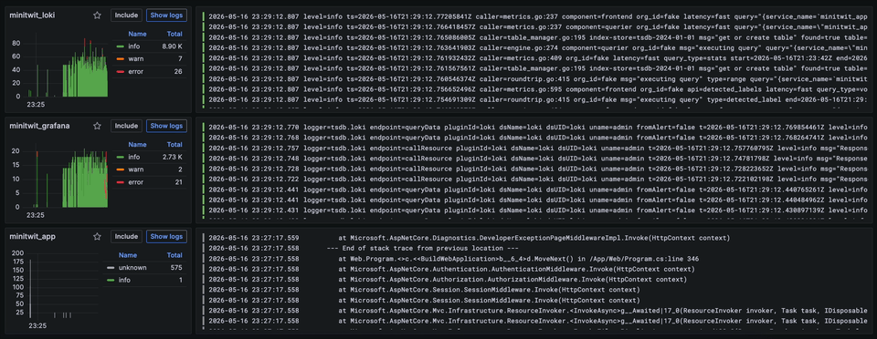
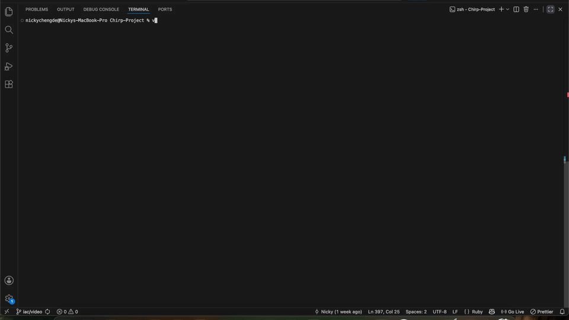
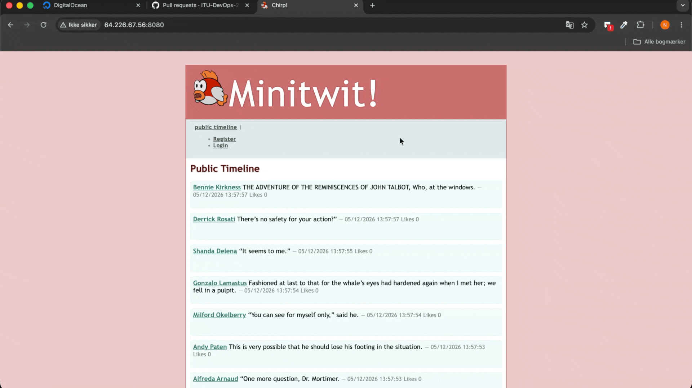

# Chirp Vee2

## Monitoring demonstration


## Logging demonstration



## IAC demonstration



## CI/CD demonstration



## Short project description

Chirp Vee2 is a minimal Twitter-like application used as a hands-on DevOps learning project. It demonstrates infrastructure-as-code, containerisation, monitoring, logging and CI/CD patterns alongside a .NET web application.

## Key demos

- Monitoring: [Monitoring.gif](Monitoring.gif)
- Logging: [Logging.gif](Logging.gif)
- Infrastructure-as-Code: [IAC.gif](IAC.gif)
- CI/CD flow: [CICD.gif](CICD.gif)

## Prerequisites

- .NET SDK 10 (net10.0 target: see [Chirp-Project/src/Web/Web.csproj](Chirp-Project/src/Web/Web.csproj#L1))
- Docker Engine (and `docker compose` / Docker Compose v2)
- Optional: Docker Swarm (for `docker stack` production deploys)
- Optional: Vagrant + plugins (`vagrant-digitalocean`, `vagrant-scp`, `vagrant-reload`)
- Git, make, and a container registry for production images (Docker Hub, GitHub Container Registry, etc.)

## Quick start — local development

1. Clone the repo and change into the project folder:

```
git clone <repo-url>
cd Chirp-Project
```

2. Run the web app locally with the .NET SDK:

```
cd Chirp-Project/src/Web
dotnet restore
dotnet build
dotnet run
```

Open your browser at `http://localhost:8080` (or the URL shown in the console).

## Run locally with Docker Compose

From the repository root you can start services with Docker Compose (development):

```
docker compose -f Chirp-Project/docker-compose.yml up --build
```

This builds images and starts services defined in `Chirp-Project/docker-compose.yml`.

## Production deploy (Docker Swarm)

To deploy the application to digital ocean simply run `vagrant up` and then head to http://157.245.27.199:8080/. (This is assuming that the virtual IP 157.245.27.199 is already setup in DigitalOcean.)

## CI/CD

CI/CD examples are included in the repository (see pipeline demos and badges).

The CI/CD pipeline for linting and security checking will automatically be triggered on any pull request and the continuous deployment pipeline will run on each push to main.

## Testing

- Unit, integration and end-to-end tests live under the `test/` folder. Run them with:

```
dotnet test test/UnitTest
dotnet test test/IntegrationTest
dotnet test test/End2EndTests
```

## Contributing

- Fork the repository and create a feature branch `git checkout -b feat/your-change`.
- Run the test suite and linters locally.
- Open a pull request with a clear description and reference to any related issues.
- CI will run builds and tests; maintainers will review and merge.

## Important files

- Compose: [Chirp-Project/docker-compose.yml](Chirp-Project/docker-compose.yml#L1)
- Stack: [docker-stack.yml](docker-stack.yml#L1)
- Web project: [Chirp-Project/src/Web/Web.csproj](Chirp-Project/src/Web/Web.csproj#L1)
- Swarm helpers: [Chirp-Project/init_swarm_manager.sh](Chirp-Project/init_swarm_manager.sh#L1)
- TLS / LB helpers: [Chirp-Project/tls.sh](Chirp-Project/tls.sh#L1) and [Chirp-Project/provision-lb.sh](Chirp-Project/provision-lb.sh#L1)
